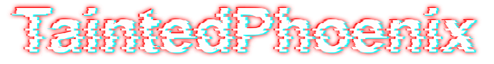

    
    

Hi! My name is Antony Rinaldi (Known online as TaintedPhoenix). I am a high school senior who is interested in just about all things computers.

 I've worked on a large variety of projects, most of which created in response to problems I found annoying enough to actually do something about. No two projects are alike! I've done all types of development: Web, App, Game, Bot, you name it. Regardless of what i'm working with, I like to create things that I find either useful or thoroughly enjoyable, and nothing less.

<h1 align="center" style="text-align: center; color: #fff;"> Languages and Skills </h1>

    
    
    
    
    
    
    
    
    
    
    
    
    
    
    
    
    
    
    
    
    
    

